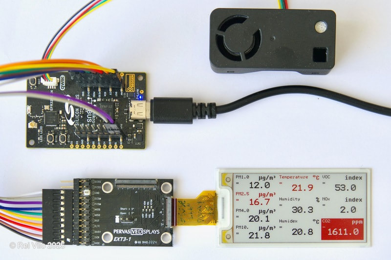

# PDI EXT3 Air Quality

The **PDI_EXT3_Air_Quality** project runs on the Silicon Labs EFR32xG24 Explorer Kit, acquires PM, RH/T, VOC, NOx and CO2 measurements from the Sensirion SN66 sensing platform, and displays them on the Pervasive Displays "Spectra 4" 2.66" four colours screen.

The project is developed with the Arduino IDE, the Silicon Labs core for Arduino and the Basic edition of the Pervasive Displays Library Suite.

## Details

The variables used are

Measure | Variable | Unit | Range
---- | ---- | ---- | ----
Particulate matter 1.0 | `pm1p0` | &micro;g/m&sup3; | 0...1000
Particulate matter 2.5 | `pm2p5` | &micro;g/m&sup3; | 0...1000
Particulate matter 4.0 | `pm4p0` | &micro;g/m&sup3; | 0...1000
Particulate matter 10.0 | `pm10p0` | &micro;g/m&sup3; | 0...1000
Temperature | `temperature` | °C | 10...40
Relative humidity | `humidity` | % | 20...80
Humidex | `humidex` | % | 10...80
VOC index | `voc` | index | 0...500
NOX index | `nox` | index | 0...500
CO2  | `co2` | ppm | 0...40000

## References

Hardware

* Pervasive Displays EXT3.1 extension board https://www.pervasivedisplays.com/product/epd-extension-kit-gen-3-ext3/
* Pervasive Displays "Spectra 4" 2.66" 266-QS-OJ https://www.pervasivedisplays.com/product/2-66-e-ink-displays/
* EFR32xG24 Explorer Kit (xG24-EK2703A) https://www.silabs.com/development-tools/wireless/efr32xg24-explorer-kit
* Sensirion SN66 https://sensirion.com/products/catalog/SEN66 

Software

* Pervasive Displays Library Suite Basic edition 9.0.3 https://github.com/rei-vilo/PDLS_Basic
* Pervasive Displays Library Suite Common library 9.0.3 https://github.com/rei-vilo/PDLS_Common
* Pervasive Displays BWRY Small driver 9.0.2 https://github.com/PervasiveDisplays/Pervasive_BWRY_Small
* Silicon Labs Arduino Core 2.2.0 https://github.com/siliconlabs/arduino/
* Sensirion I&sup2;C SEN66 Arduino Library 1.0.1 https://github.com/Sensirion/arduino-i2c-sen66
* Sensirion Arduino Core Library 0.7.1 https://github.com/Sensirion/arduino-core

Algorithms

* Wind Chill and Humidex https://ptaff.ca/humidex/?lang=en_CA
* Humidex scores https://www.researchgate.net/figure/HUMIDEX-scores-by-air-temperature-o-C-and-relative-humidity-source_fig1_29462712
* Humidex thresholds https://www.canada.ca/en/environment-climate-change/services/seasonal-weather-hazards/warm-season-weather-hazards.html#toc7
* Air quality https://www.researchgate.net/figure/Air-Quality-Thresholds-for-PM25-PM10-and-CO2_fig2_342820337
* Thresholds answered by ChatGPT [Air Quality Thresholds](./Air_Quality_Thresholds.md)  

## Issues

None 

## Licence

**Copyright** &copy; Rei Vilo, 2010-2025

*For exclusive use with Pervasive Displays screens*

**Licence** [Attribution-NonCommercial-ShareAlike 4.0 International (CC BY-NC-SA 4.0)](./LICENCE.md)

**Portions** &copy; Sensirion, 2024
